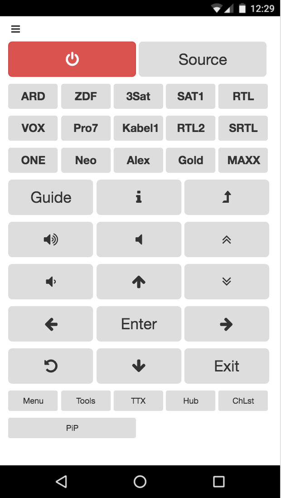

# TriUniversalWebRemote

My personal IR-Remote-Control for 5 devices.

## Motivation

Many people nowadays have a lot of devices around, most of them using IR-Remote-Controls, so i do. I simply was fed up with carrying those controls around when moving from the desk to my sofa and vice versa. After purchasing another device - a LED-stripe with yet another control - i seriously thought about buying a universal remote control. But the fixed layout of the buttons of the usual products annoyed me. Thus i decided, to build my own universal IR remote control, providing kind of RESTful API, to control my devices. And to code a nice looking Web-Interface for it - only with the buttons i use and suiting perfectly my personal needs.

## Implementation

The first litter i made was with a ESP8266 nodemcu v1 and one IR-LED. I am using the [IRremoteESP8266 library from markszabo](https://github.com/markszabo/IRremoteESP8266). I also built up a simple IR-Receiver (nodemcu v3, too) with a slightly modified receiver sketch based on an example provided by this library for two purposes: sniffing my 5 existing remotes and checking the sent IR-codes by my own implementation.

This way 5 files in here may of considerable interest:
- IR-codes for a Samsung UE46F6500 (and for sure also other Samsung TVs)
- IR-codes for a older Kenwood 5.1 Receiver (KRF-X9060D)
- IR-codes for a cheap SEG DVD-Player
- IR-codes for a Paulmann LED-stripe
- IR-codes for a GigaBlue receiver (HD 800 UE plus)

The first problem i ran into was the fact, that my devices aren't located at one place but two of those around four meters away from the other three. The most IR-LEDs - and especially the cheap ones - have a emitter angle of around 20°. So using two emitters was the solution. While meditating on the wiring a very similar project gave useful hints: [WiFi IR Blaster](https://create.arduino.cc/projecthub/BuddyC/wifi-ir-blaster-af6bca).

Inspired by BuddyC's [simple schema](https://create.arduino.cc/projecthub/BuddyC/wifi-ir-blaster-af6bca#schematics) it was easy to manage. (i added a more described version of a fritzing here for people as clumsy as me in wiring - it always takes me hours - i'm more in coding which is easy for me)

The quasi RESTful API follows the pattern GET /&lt;device&gt;/&lt;command&gt; and pointing directly to a simple server running on the ESP8266 nodemcu. So hitting http://&lt;ip-of-the-node&gt;/&lt;device&gt;/&lt;command&gt; in a browser will be translated into an infrared signal and sent by the two IR-LEDs.

Another approach of implementing an ir-remote with an ESP8266 can be found [here](https://alexbloggt.com/universal-infrarot-websteuerung-ueber-esp8266/). But i do not like the missing validation of the user input - as a developer i consider this as bad style - and the delegation of the detailed implementation to the interface looks ugly: the interface needs to have knowledge about the correct ir-protocol and the specific command codes.

A modularised implementation of HTTP-Update based on [another project](https://github.com/count023/esp-http-update-server) by me was added, too: (see GpioneersHttpUpdate.*) It’s to provide a simple way to update the device without USB-connection to the computer.

## Fritzing

### schematic view

### breadboard view

## How To Use

- adapt the passwords.h.example as described in the file
- adapt the GpioneersHttpUpdate.h to point to your update server
- adapt the methods like handleTv and create similar .h-files like samsung_remote_codes.h for the ir-remote-codes of your special devices
- finally push the compiled code to your ESP8266, for example by using [Arduino IDE](https://www.arduino.cc/en/main/software)
- put the file interface.html somewhere on a server in your LAN
(hope you have one. This code will not work as a local file opened in a browser due to CrossSideScripting-restrictions - if so, you need to change it, for example by using a hidden image-tag updated with the desired URI or so)

## ToDo

The implementation of the methods like handleTv are bloody simple by now. I simply didn’t manage it to get use of a two dimensional HashMap for the translation of the HTTP-request-path into an IR-command. (Some trials of this are in the code right now - but they do not work yet)
